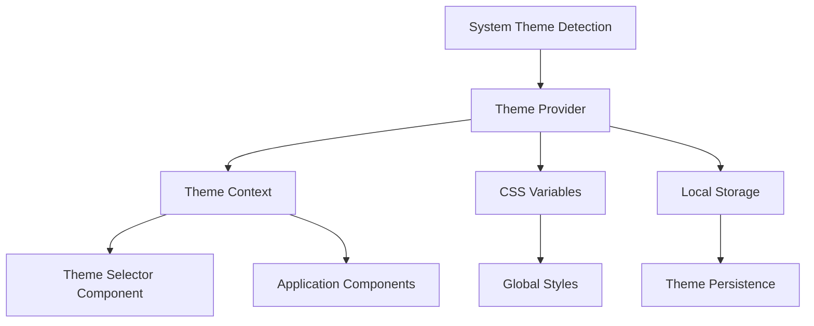

# Design Document

## Overview

The theme selection system will be implemented as a React context-based solution using CSS custom properties (variables) for dynamic styling. The system will provide a centralized theme management approach that allows real-time theme switching while maintaining performance and accessibility standards.

## Architecture

### High-Level Architecture



### Component Hierarchy

- **ThemeProvider**: Root-level provider that manages theme state and CSS variables
- **ThemeContext**: React context for sharing theme data across components
- **ThemeSelector**: UI component for theme selection interface
- **useTheme**: Custom hook for accessing theme functionality in components

## Components and Interfaces

### Theme Data Structure

```typescript
interface ColorTheme {
  id: string;
  name: string;
  displayName: string;
  description: string;
  colors: {
    primary: string;
    secondary: string;
    accent: string;
    background: string;
    surface: string;
    text: {
      primary: string;
      secondary: string;
      muted: string;
    };
    border: string;
    success: string;
    warning: string;
    error: string;
    info: string;
  };
  shadows: {
    small: string;
    medium: string;
    large: string;
  };
}

interface ThemeContextType {
  currentTheme: ColorTheme;
  availableThemes: ColorTheme[];
  setTheme: (themeId: string) => void;
  systemTheme: 'light' | 'dark' | null;
  isSystemThemeDetected: boolean;
}
```

### ThemeProvider Component

```typescript
interface ThemeProviderProps {
  children: React.ReactNode;
  defaultTheme?: string;
  storageKey?: string;
}

const ThemeProvider: React.FC<ThemeProviderProps> = ({
  children,
  defaultTheme = 'pastel',
  storageKey = 'wishlist-theme'
}) => {
  // Implementation details in tasks
};
```

### ThemeSelector Component

```typescript
interface ThemeSelectorProps {
  variant?: 'dropdown' | 'modal' | 'inline';
  showPreview?: boolean;
  className?: string;
}

const ThemeSelector: React.FC<ThemeSelectorProps> = ({
  variant = 'dropdown',
  showPreview = true,
  className
}) => {
  // Implementation details in tasks
};
```

## Data Models

### Predefined Themes

#### 1. Pastel Theme (Original)
- Primary: #E6E6FA (Lavender)
- Secondary: #FFB6C1 (Light Pink)
- Accent: #98FB98 (Pale Green)
- Background: #FAFAFA
- Surface: #FFFFFF

#### 2. Light Theme
- Primary: #2563EB (Blue)
- Secondary: #7C3AED (Purple)
- Accent: #059669 (Green)
- Background: #FFFFFF
- Surface: #F8FAFC

#### 3. Dark Theme
- Primary: #3B82F6 (Light Blue)
- Secondary: #8B5CF6 (Light Purple)
- Accent: #10B981 (Light Green)
- Background: #0F172A
- Surface: #1E293B

#### 4. High Contrast Theme
- Primary: #000000
- Secondary: #FFFFFF
- Accent: #FFD700 (Gold)
- Background: #FFFFFF
- Surface: #F5F5F5

### CSS Variable Mapping

```css
:root {
  --color-primary: #{theme.colors.primary};
  --color-secondary: #{theme.colors.secondary};
  --color-accent: #{theme.colors.accent};
  --color-background: #{theme.colors.background};
  --color-surface: #{theme.colors.surface};
  --color-text-primary: #{theme.colors.text.primary};
  --color-text-secondary: #{theme.colors.text.secondary};
  --color-text-muted: #{theme.colors.text.muted};
  --color-border: #{theme.colors.border};
  --shadow-small: #{theme.shadows.small};
  --shadow-medium: #{theme.shadows.medium};
  --shadow-large: #{theme.shadows.large};
}
```

## Correctness Properties

*A property is a characteristic or behavior that should hold true across all valid executions of a system-essentially, a formal statement about what the system should do. Properties serve as the bridge between human-readable specifications and machine-verifiable correctness guarantees.*

### Property 1: Theme Data Completeness
*For any* theme in the available themes list, it should contain all required color properties (primary, secondary, accent, background, surface, text colors, border) and have a non-empty, descriptive name.
**Validates: Requirements 2.1, 2.5, 1.4**

### Property 2: Theme Selection Interaction
*For any* theme selector interaction, clicking the selector button should display all available themes with visual previews, and the currently selected theme should be visually highlighted.
**Validates: Requirements 1.2, 1.3, 1.5**

### Property 3: Comprehensive Theme Application
*For any* theme selection, the new theme should be applied immediately to all interface elements including components, CSS variables, charts, and interactive states without requiring a page refresh.
**Validates: Requirements 3.1, 3.2, 3.4, 3.5, 7.5**

### Property 4: Theme Persistence Round Trip
*For any* theme selection, the choice should be stored immediately and when the application reloads, the same theme should be retrieved and applied.
**Validates: Requirements 4.1, 4.2, 4.5**

### Property 5: System Theme Detection
*For any* system color scheme preference (light/dark), when no user preference is stored, the system should detect and apply the corresponding theme, but stored preferences should always override system detection.
**Validates: Requirements 5.1, 5.2, 5.3, 5.4, 5.5**

### Property 6: Accessibility Compliance
*For any* theme, all color combinations should meet WCAG 2.1 AA contrast requirements, focus indicators should be visible, and interactive elements should have sufficient color differentiation from backgrounds.
**Validates: Requirements 6.1, 6.3, 6.4**

### Property 7: Theme Context Propagation
*For any* theme change, all components using the theme context should receive the updated theme data and re-render with new styles immediately.
**Validates: Requirements 7.4, 7.5**

### Property 8: CSS Variables Synchronization
*For any* theme change, all CSS custom properties should be updated to match the new theme's color values.
**Validates: Requirements 7.2**

### Property 9: Theme Preview Functionality
*For any* theme preview action, the interface should temporarily show the preview theme without affecting the stored preference, and preview should be reversible.
**Validates: Requirements 8.4, 8.5**

### Property 10: Mobile Responsiveness
*For any* mobile viewport size, the theme selector should adapt its layout appropriately and maintain touch-friendly interaction targets.
**Validates: Requirements 10.2, 10.3, 10.4**

### Property 11: Error Handling Resilience
*For any* storage error or unavailable localStorage, the theme system should continue functioning with default themes and graceful degradation.
**Validates: Requirements 4.4**

### Property 12: Performance Optimization
*For any* theme change, the system should minimize component re-renders and cache theme data for efficient access.
**Validates: Requirements 9.3, 9.5**

<function_calls>
<invoke name="prework">
<parameter name="featureName">theme-selection

## Error Handling

### Storage Errors
- **localStorage Unavailable**: Fall back to in-memory theme state with session persistence
- **Storage Quota Exceeded**: Clear old theme preferences and retry storage
- **Invalid Stored Data**: Reset to default theme and clear corrupted storage

### Theme Loading Errors
- **Missing Theme Data**: Fall back to default pastel theme
- **Invalid Theme Structure**: Validate theme data and use fallback colors
- **CSS Variable Application Failure**: Retry with direct style application

### System Integration Errors
- **Media Query Failure**: Default to light theme if system detection fails
- **Context Provider Missing**: Provide error boundary with default theme context
- **Hook Usage Outside Provider**: Throw descriptive error with usage instructions

## Testing Strategy

### Dual Testing Approach
The theme selection system will use both unit tests and property-based tests to ensure comprehensive coverage:

- **Unit Tests**: Verify specific examples, edge cases, and error conditions
- **Property Tests**: Verify universal properties across all inputs and theme combinations
- Both approaches are complementary and necessary for complete validation

### Property-Based Testing Configuration
- **Testing Library**: React Testing Library with Jest for property-based testing
- **Minimum Iterations**: 100 iterations per property test
- **Test Tagging**: Each property test tagged with format: **Feature: theme-selection, Property {number}: {property_text}**

### Unit Testing Focus Areas
- Specific theme switching scenarios
- Error handling with corrupted storage
- Mobile viewport behavior
- System theme detection edge cases
- Component integration points

### Property Testing Focus Areas
- Theme data structure validation across all themes
- CSS variable application for any theme change
- Storage persistence for any theme selection
- Accessibility compliance across all theme combinations
- Context propagation to any component using the theme

### Testing Environment Setup
- Mock localStorage for storage testing
- Mock matchMedia for system theme detection testing
- Mock CSS custom property support for older browser testing
- Responsive viewport testing for mobile scenarios

### Performance Testing
- Measure theme switching performance with React DevTools Profiler
- Validate minimal re-renders during theme changes
- Test theme caching effectiveness
- Monitor CSS variable update performance

### Accessibility Testing
- Automated contrast ratio validation for all themes
- Focus indicator visibility testing across themes
- Screen reader compatibility testing (manual)
- Keyboard navigation testing across theme selector interfaces