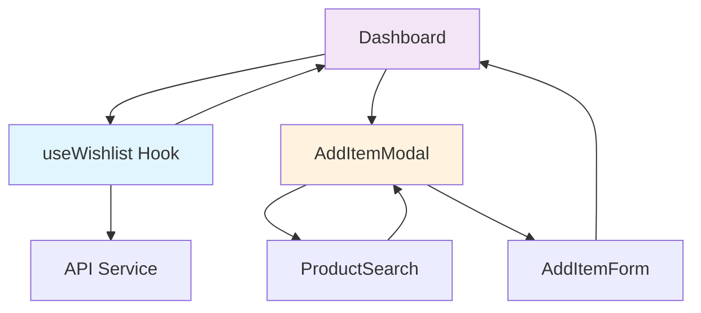
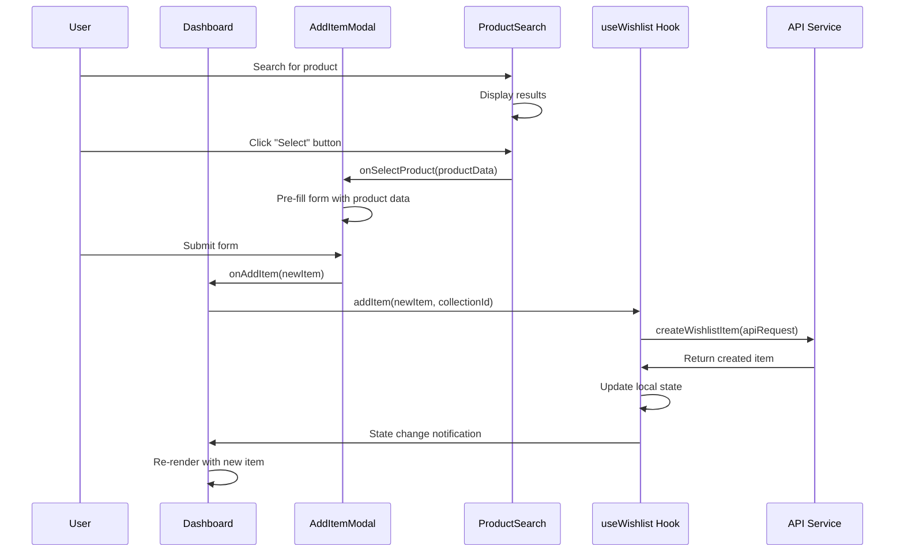

# Design Document: Wishlist State Management Fixes

## Overview

This design addresses critical state management issues in the wishlist application by properly integrating the useWishlist hook with the Dashboard component and fixing ProductSearch button functionality. The solution ensures real-time UI updates and consistent state management across all components.

## Architecture

### Current Problems

1. **Dashboard bypasses useWishlist hook**: Calls `apiService.createWishlistItem` directly instead of using `addItem` from the hook
2. **State desynchronization**: Local state not updated after API calls, requiring page refresh
3. **ProductSearch button issues**: Event handling problems prevent "Select" button from working
4. **Inconsistent error handling**: Errors not properly propagated through the state management layer

### Proposed Solution



## Components and Interfaces

### Dashboard Component Refactoring

**Current Implementation Issues:**
- Directly calls `apiService.createWishlistItem`
- Manually manages `isSubmitting` state
- Doesn't use `addItem` from useWishlist hook

**New Implementation:**
```typescript
// Remove direct API calls
const handleAddItem = async (newItem: WishlistItem) => {
  if (!selectedCollection) {
    throw new Error('Debes seleccionar una lista antes de agregar un artículo');
  }
  
  // Use useWishlist hook instead of direct API call
  const success = await addItem(newItem, parseInt(selectedCollection.id));
  
  if (success) {
    // Reload collections to update item counts
    await loadCollections();
    setIsAddModalOpen(false);
  }
  // Error handling is managed by useWishlist hook
};
```

### ProductSearch Component Fixes

**Current Issues:**
- Event propagation conflicts
- Button click handlers not working properly
- Inconsistent event handling between card click and button click

**Fixed Event Handling:**
```typescript
// Fix card click handler
<div
  className="search-result-card"
  onClick={() => handleSelectProduct(result)}
>
  {/* Product content */}
  
  {/* Fix button click handler */}
  <Button
    onClick={(e) => {
      e.stopPropagation(); // Prevent card click
      handleSelectProduct(result);
    }}
  >
    Select
  </Button>
</div>
```

### useWishlist Hook Integration

**Enhanced Hook Usage:**
- Dashboard uses `addItem`, `updateItem`, `deleteItem` methods
- Hook manages all API calls and state updates
- Consistent error handling through hook's error state
- Automatic state synchronization

## Data Models

### State Flow Architecture



## Correctness Properties

*A property is a characteristic or behavior that should hold true across all valid executions of a system-essentially, a formal statement about what the system should do. Properties serve as the bridge between human-readable specifications and machine-verifiable correctness guarantees.*

### Property Reflection

After analyzing all acceptance criteria, several properties can be consolidated:
- Properties 1.1, 1.2, and 1.3 all relate to proper hook integration and can be combined into a comprehensive state management property
- Properties 2.1, 2.3, and 2.4 all relate to ProductSearch event handling and can be combined
- Properties 3.1 and 3.2 both relate to hook being the single source of truth
- Properties 4.1, 4.2, and 4.4 all relate to error handling consistency

### Core Properties

Property 1: Dashboard Hook Integration
*For any* item addition operation, the Dashboard should use the useWishlist hook's addItem method, and the hook's state updates should immediately reflect in the Dashboard UI without requiring page refresh
**Validates: Requirements 1.1, 1.2, 1.3**

Property 2: ProductSearch Event Handling
*For any* product search result, both card clicks and button clicks should trigger the onSelectProduct callback with correct product data, and button clicks should not propagate to card click handlers
**Validates: Requirements 2.1, 2.3, 2.4**

Property 3: Modal State Transitions
*For any* product selection from ProductSearch, the AddItemModal should transition to manual entry form with the selected product data pre-filled
**Validates: Requirements 2.2**

Property 4: Hook as Single Source of Truth
*For any* wishlist data operation (add, update, delete), the useWishlist hook should manage all state changes and provide consistent data to all consuming components
**Validates: Requirements 3.1, 3.2, 3.4**

Property 5: Collection Count Consistency
*For any* successful item operation, collection item counts should be updated to reflect the current state
**Validates: Requirements 3.3**

Property 6: Error Handling Consistency
*For any* API error in the useWishlist hook, the error should be properly displayed in the Dashboard UI, and when errors are resolved, the error states should be cleared appropriately
**Validates: Requirements 4.1, 4.2, 4.4**

## Error Handling

### Error Propagation Strategy

1. **useWishlist Hook Error Management**
   - Hook captures all API errors
   - Provides error state to consuming components
   - Maintains error messages until explicitly cleared

2. **Dashboard Error Display**
   - Shows errors from useWishlist hook in UI
   - Provides clear error messages to users
   - Offers retry mechanisms through hook methods

3. **Modal Error Handling**
   - AddItemModal remains open on errors
   - Displays specific error messages
   - Allows users to correct issues and retry

### Error Recovery Mechanisms

- **Automatic retry**: For transient network errors
- **Manual retry**: User-initiated through refresh buttons
- **Error clearing**: Automatic on successful operations
- **Graceful degradation**: UI remains functional during errors

## Testing Strategy

### Dual Testing Approach

This implementation requires both unit tests and property-based tests to ensure comprehensive coverage:

**Unit Tests:**
- Specific error scenarios and edge cases
- Component integration points
- Event handling edge cases
- Modal state transitions

**Property-Based Tests:**
- Universal properties across all user interactions
- State consistency across component re-renders
- Error handling across different failure modes
- Event handling across different user input patterns

### Property-Based Testing Configuration

- **Testing Framework**: Jest with @fast-check/jest for property-based testing
- **Test Iterations**: Minimum 100 iterations per property test
- **Test Tagging**: Each property test references its design document property
- **Coverage**: All correctness properties must have corresponding property-based tests

### Testing Focus Areas

1. **State Management**: Verify hook integration and state synchronization
2. **Event Handling**: Test ProductSearch button and card interactions
3. **Error Scenarios**: Validate error propagation and recovery
4. **UI Consistency**: Ensure real-time updates without page refresh

<function_calls>
<invoke name="prework">
<parameter name="featureName">wishlist-state-fixes